#  CALL CENTER TRENDS: Customer Satisfaction and Agent Behavior

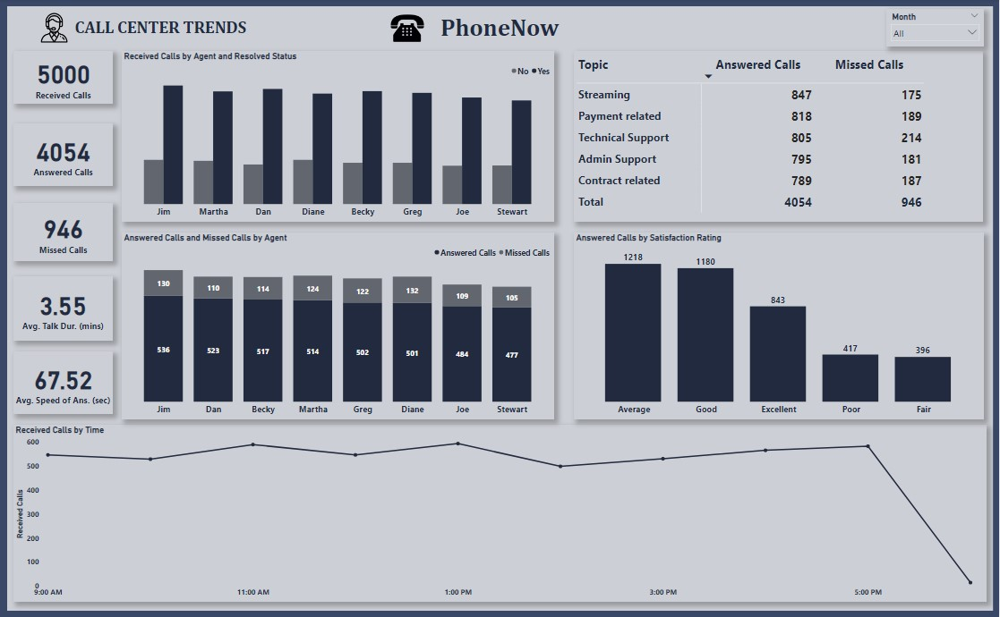

## INTRODUCTION
This is a power BI project on customer satisfaction and agent behavior analysis for a telecom company called "PhoneNow". It is my first task of the internship with PwC Switzerland Power BI virtual case experience.
When it comes to service providers, the priority is the customers/clients and how best to serve/satisfy their needs. Customer service is very important because the more effective the customers' satisfaction, the more the services of the company will be patronized leading to the growth of the company.
For this project, I worked on a customer service dataset that contains the data of calls received, issues/topics of complaint as well as the performance and behaviour of agents to the concerns of the customers/clients over the period of the first quarter of the year 2021. I am always excited to analyze datasets that will drive real-world impacts. The aim of this project is to gain insights into agents' performance and customer satisfaction in the company to give recommendations on areas of improvement.

## PROBLEM STATEMENT

The Call Center Manager, Claire, at PhoneNow, needs transparency and insights from the dataset gathered in the first quarter of 2021. Most especially, an accurate overview of long-term customer and agent behaviour trends.
The main objective of this project was to create a dashboard in Power BI for Claire that reflects all relevant Key Performance Indicators (KPIs) and metrics in the dataset. _Get creative!_ 

The Key Performance Indicators include:

1. Overall customer satisfaction
2. Overall calls answered/abandoned
3. Calls by time
4. Average speed of answer
5. Agent’s performance quadrant, that is, average handle time (talk duration) vs calls answered

**_Let's go!_**

## SKILL DEMONSTRATED

The tool used for the analysis was Microsoft Power BI. The Power BI concepts that were used include;

- DAX (Data Analysis Expression) Concept for Calculated Measures.
- Power Query Editor for data cleaning (Conditional Columns and Added Columns)
- Data Visualization 

## DATA SOURCING

The dataset was obtained through PwC Switzerland Case Experience on Forage which contains data on customers, calls received, calls resolved, attending agent, time and duration of calls and date of calls received.

### Data Structure

The data is in on,,a structured Excel Worksheet document (xls) format. It contains 10 columns and 5000 rows. The table had the following columns:

- Call ID: It contains unique identity codes for individual calls received.
- Agent: It contains the name of the agent that received the call.
- Answered: It contains the status of the call received, either answered or missed.
- Average Talk Duration: It contains the average duration of the call.
- Date: It contains the date the calls were received 
- Resolved: It contains data of the status of the reason for the call, either resolved or not.
- Satisfaction rating: It contains the satisfaction rating by the customer.
- Speed of answer in seconds: It contains how fast (in seconds) the call was answered.
- Time: It contains the exact time the call was received.
- Topic: It contains the reason the customer called.

## DATA TRANSFORMATION

Before moving to any analysis, the Call Center dataset was imported into Power Query on Microsoft Power BI. The following transformations were done:
Check for blank cells or missing values in the dataset.

- Correction of data types, especially dates, time and duration.
- The Replace Values function was used to replace all "Y" and "N" with "Yes" and "No" in the Answered and Resolved columns.
- A conditional column was added to categorize the Satisfaction rating column into "Poor", "Fair", "Average", "Good" and "Excellent".
- The Avg_Talk_Duration column was changed into a decimal data type and measured in minutes.

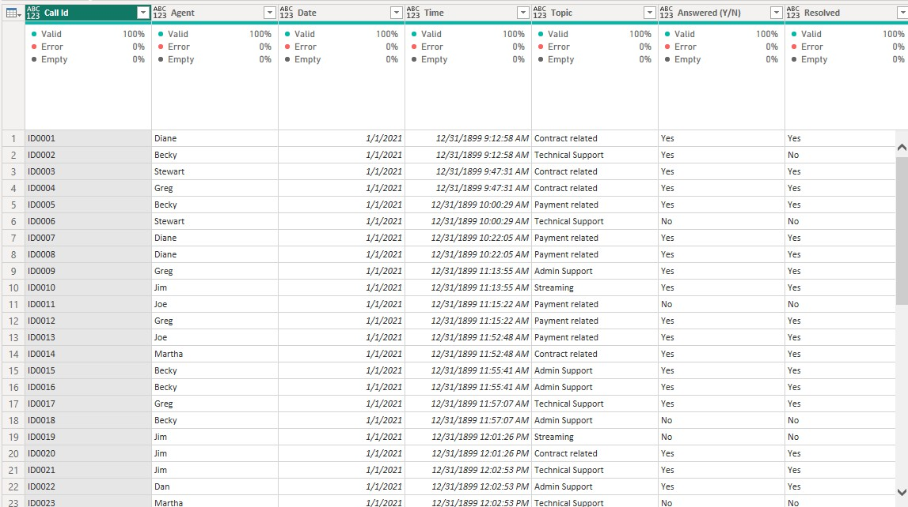

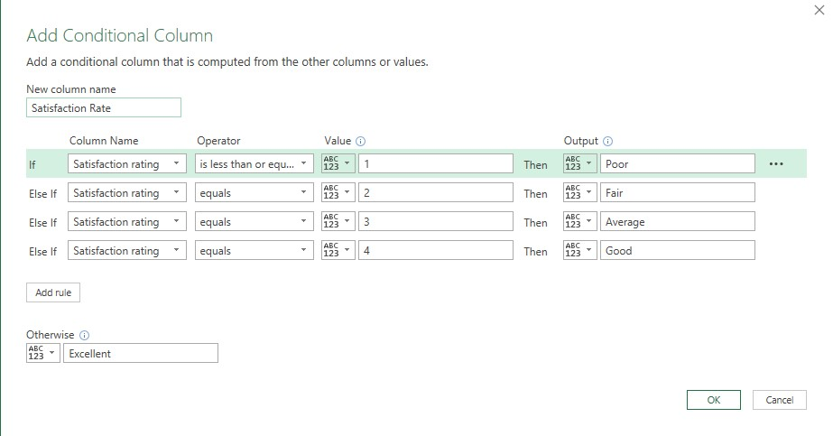

## MODELLING

There was no modelling needed as the dataset contains only one detailed table.

## ANALYSIS AND VISUALIZATIONS

In this step, I carried out an exploratory analysis of the data to answer the Key Performance Indicators that were stated earlier.

### Objective One

Overall customer satisfaction - What is the distribution of answered calls by customer satisfaction?

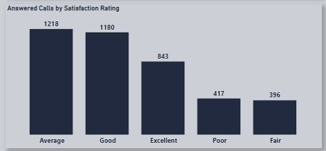

### Objective Two

Overall calls answered/abandoned - What is the total number of calls answered?

What is the total number of calls abandoned/missed?

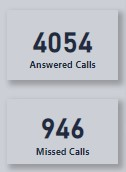

### Objective Three

Calls by time - What is the total call received based on time?

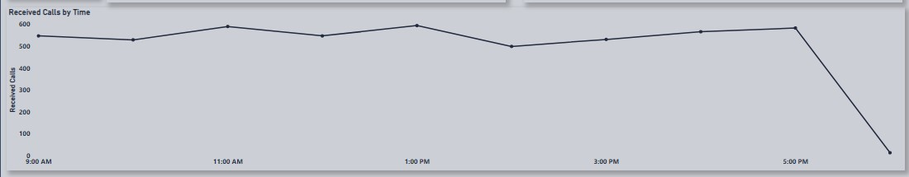

### Objective Four 

Average speed of answer - What is the average duration spent before calls were answered?

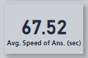

### Objective Five 

Agent’s performance quadrant, that is, average handle time (talk duration) vs calls answered 

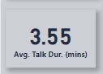

What is the distribution of calls received to calls resolved by agents?

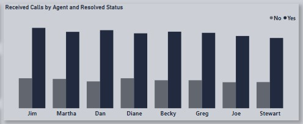

What is the distribution of calls answered and missed by agents?

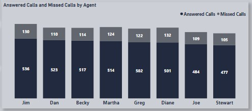

What is the distribution of calls by call topic?

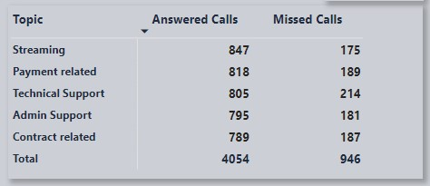

## CONCLUSION 

The analysis has provided valuable insights that can help the Call Center make informed decisions and take proactive measures to improve customer satisfaction and Agent performance. By addressing the key issues identified in the analysis, the Call Center can create a more positive environment that fosters employee performance and improves customer satisfaction.

You can interact with the dashboard [here](https://app.powerbi.com/view?r=eyJrIjoiYWI0ZDgzMzYtNWM2OS00OGRhLTk4ZmUtOTM0NWI4Y2UxYWE1IiwidCI6Ijk2NDA1NDAwLWI5ZWEtNGQ2My05MDcyLTk4Zjk2OTJmM2VmOCJ9)

I had a great and interesting experience working on this project. I hope you had as much fun as I did. Interact with the dashboard and let me know what you think!

_Your feedback is very important to me and my growth as a data analyst. Follow for more exciting data analysis projects from PsycheXAnalyst._
